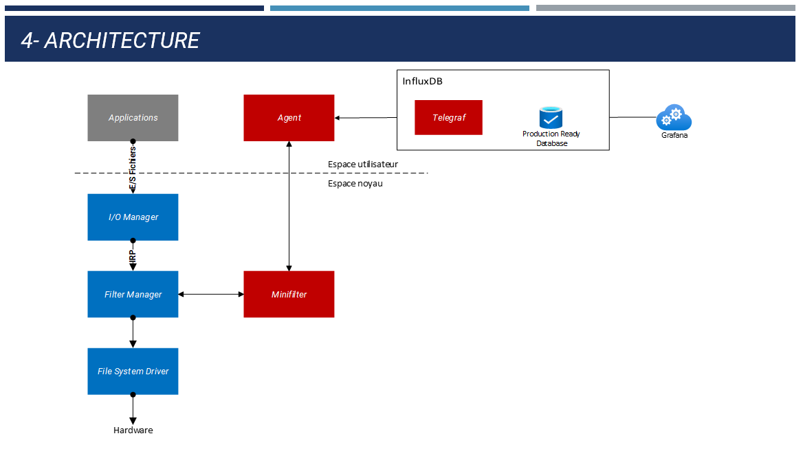

Translations:
- Chinese: / 中文: <a href=./README_CN.md>README_CN</a>

 

  

  <h2 align="center">Owlyshield</h2>
  

  

	An AI antivirus written in Rust
     
    <a href="http://doc.owlyshield.com"><strong>Explore the Doc</strong></a>
     
     
    <a href="https://www.owlyshare.com">Access training data</a>
    ·
    <a href="http://doc.owlyshield.com">Read the technical doc</a>
    ·
    <a href="https://github.com/SitinCloud/Owlyshield/issues">Request Feature</a>
  

  
Table of Contents

  <ol>
    <li>
      <a href="#owlyshield">Owlyshield</a>
      <ul>
        <li><a href="#how-does-it-work">How does it work?</a></li>
        <li><a href="#how-was-the-model-trained">How was the model trained?</a></li>
		<li><a href="#open-source-philosophy">Open-source philosophy</a></li>
        <li><a href="#community-vs-commercial-versions">Community vs commercial versions</a></li>
        <li><a href="#business model">Business model</a></li>
     </ul>
    </li>
    <li>
      <a href="#getting-started">Getting Started</a>
      <ul>
        <li><a href="#prerequisites">Prerequisites</a></li>
        <li><a href="#installation">Installation</a></li>
      </ul>
    </li>
    <li><a href="#roadmap">Roadmap</a></li>
    <li><a href="#contributing">Contributing</a></li>
    <li><a href="#license">License</a></li>
    <li><a href="#contact">Contact</a></li>
    <li><a href="#acknowledgments">Acknowledgments</a></li>
  </ol>

## Owlyshield

Owlyshield is an open-source AI-driven antivirus engine written in [Rust](https://rust-lang.org). It is particularly efficient against ransomwares.

### How does it work?

1. A minifilter (a file system filter driver) intercepts I/O request packets (IRPs) to collect metadata about what happens on the disks (*DriverMsg* in the sources),
2. *Owlyshield-predict* uses the previously created *DriverMsgs* to compute features submitted to a RNN (a special type of neural network wich works on sequences). Behavioural as well as static analysis are performed.
3. If the RNN predicts a malware, *owlyshield-predict* asks the minifilter to kill the malicious processes and send a very detailed report about what happened to your SIEM tools (and/or a local file).

### How was the model trained?

The model was trained with malwares from the real world collected from very diverse places on the internet (dark web, by sharing with researchers, analysis of thousands of downloads with virustotal).

We ran them on Windows VMs with owlyshield working in a specific mode (`--features record`) to save the IRPs. *Owlyshield-predict* with `--features replay` was then used to write the learning dataset (a csv file).

The [malwares-ml](https://github.com/SitinCloud/malwares-ml) repository is the place where we share some of our learning datasets.

### Open-source philosophy

We at [SitinCloud 🇫🇷](https://github.com/SitinCloud) strongly believe that cybersecurity products should always be open-source. 
1. In addition to the source code, we provide a complete wiki and code documentation,
2. There is no need to pay highly expensive consulting firms to audit open-source code in order to check it does not add a new vulnerability by itself. This should significantly reduce the cost of certification by government cybersecurity agencies, which can be very high if none of your relatives are employed there. The fact of the matter is that any interested expert in the world can perform all necessary security checks for free.
3. Open-source products can be considered as sovereign solutions because there is no risk of any foreign agency introducing hidden backdoor or mass surveillance features users may not be aware of.
4. We provide specific entrypoints in the code to make interfacing with third-party tools easy (specifically SIEM and EDRs).

### Community vs commercial versions

The community version is fully operational and will efficiently protect your system against ransomwares. You don't need anymore to start Windows in test-signing mode since we now provide the signed driver in the community version.

The commercial version adds the following features:
* A webapp gathering all incidents data to help IT staff to understand the scope of the attack within the company networks and act accordingly (or classify it as a false positive),
* Interfaces with your log management tools (we even provide an API),
* Scheduled tasks to auto-update the application.

Within the frame of the community version usage we will do our best to help you finding a solution for any issue you may rise in the GitHub issue management system (https://github.com/SitinCloud/Owlyshield/issues).
However we cannot guaranty that we will do it in an immediate nor quick way.

Issues that subscribers to our commercial version or valued added reseelers may rise will of course be handled in priority.

### business model

Although commercial products or services can be directly purchased from us (feel free to contact us directly for any quotation that could suit your need), we think that our products should be distributed to end customer in an indirect way.

So if you want to become a distribution partner or use our products as an MSSP please contact us since we are opened to such kind of partnerhips.

If you want to integrate Owlyshield as part of your own EDR / XDR system please contact us we will be pleased to issue the best proposal for appropriate level of professional services to do so. 

If you need to protect your critical business servers against crafted attacks or progressive wipers, we can introduce you with our brand new novelty detection engine based on encoders AI tools. Feel free to contact us for a presentation and a demo.

(<a href="#top">back to top</a>)

## Getting Started

### Prerequisites for building from the source code

1. Install the [Microsoft Visual C++ Redistributable](https://docs.microsoft.com/en-us/cpp/windows/latest-supported-vc-redist?view=msvc-170) packages
2. [Disable "Driver Signature Enforcement"](https://docs.microsoft.com/en-us/windows-hardware/drivers/install/test-signing) at Windows startup. This is only required if you did not [get a copy](mailto:register@sitincloud) of the driver signed by Microsoft for [SitinCloud](https://wwww.sitincloud.com) (we provide it for free if you are a contributor).

### Installation

We regularly release installers (in the *Releases* GitHub section). You may need to enable the driver signin mode (the Signed Driver is part of the commercial version) as explained in *Prequisites*.

Please refer to the Wiki if you prefer to build it yourself.

(<a href="#top">back to top</a>)

## Roadmap

- [x] Release the windows driver (minifilter)
- [x] Documentation
	- [x] Source code doc
	- [ ] Wiki
	- [ ] Pre-print
- [x] Model (RNN)
	- [x] behavioral features
	- [ ] static features
	- [ ] TBTT with TFlite (it does not support stateful LSTMs)
- [x] connectors
	- [x] strategy pattern
	- [x] connector with Sitincloud's interface
	- [ ] others connectors with proprietary and open-source projects
- [ ] Linux Driver?

Suggestions are welcome (see *Contributing*).

See the open issues for a full list of proposed features (and known issues).

(<a href="#top">back to top</a>)

## Contributing

We help our contributors by providing them with:
- A copy of the driver signed by Microsoft,
- A free access to [Owlyshare](https://www.owlyshare.com), the place where we store our learning data (and vast collections of malwares) if needed,

If you have a suggestion that would make this better, please fork the repo and create a pull request. You can also simply open an issue with the tag "enhancement".
Don't forget to give the project a star! Thanks again!

1. Fork the Project
2. Create your Feature Branch (`git checkout -b feature/AmazingFeature`)
3. Commit your Changes (`git commit -m 'Add some AmazingFeature'`)
4. Push to the Branch (`git push origin feature/AmazingFeature`)
5. Open a Pull Request

(<a href="#top">back to top</a>)

## License

Distributed under the EUPL v1.2 license. See `LICENSE.txt` for more information.

(<a href="#top">back to top</a>)

## Contact

Damien LESCOS - [@DamienLescos](https://twitter.com/DamienLescos) - [opensource@sitincloud.com](mailto:opensource@sitincloud.com)

Project Link: [https://github.com/SitinCloud/Owlyshield/](https://github.com/SitinCloud/Owlyshield/)

Company Link: [SitinCloud](https://www.sitincloud.com)

(<a href="#top">back to top</a>)

## Acknowledgments

* [RansomWatch](https://github.com/RafWu/RansomWatch)
* [Behavioural machine activity for benign and malicious Win7 64-bit executables](https://research.cardiff.ac.uk/converis/portal/detail/Dataset/50524986?auxfun=&lang=en_GB)
<!--* [LSTM Hyper-Parameter Selection for Malware Detection: Interaction Effects and Hierarchical Selection Approach](https://arxiv.org/pdf/2109.11500.pdf)-->

(<a href="#top">back to top</a>)

