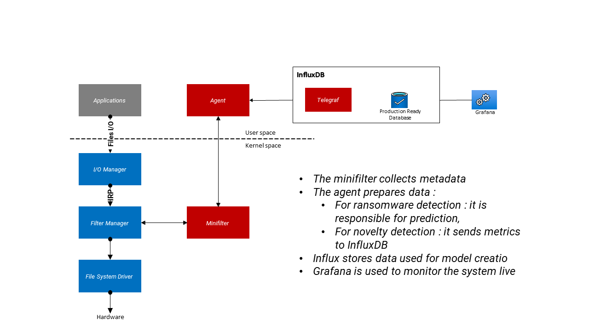

Translations:

- Chinese: / 中文: <a href=./README_CN.md>README_CN</a>

 

  

<h2 align="center">Owlyshield</h2>
  

	  An AI antivirus written in Rust
  

  

	
	
  

  

    :test_tube: <a href="https://github.com/SitinCloud/malwares-ml">Access training data</a>
    ·
    :book: <a href="http://doc.owlyshield.com">Read the technical doc</a>
    ·
    :speech_balloon: <a href="https://github.com/SitinCloud/Owlyshield/issues">Request Feature</a>
  

	

## :owl: The owl's hoot: troubles-hoot!

Owlyshield is an open-source AI-driven antivirus engine written in [Rust](https://rust-lang.org). Static analysis as
performed by AV is only able to detect known threats, explaining why hackers are adapting so quickly and ransom attacks
surging. We provide an embedded behavioural analysis AI that is able to detect and kill ransomwares in their very early
execution.

We have put a lot of efforts into making the application fast, through multithreading and machine learning algorithms like random forests, which are quick to compute.

## :vulcan_salute: Open-source philosophy

We at [SitinCloud 🇫🇷](https://www.sitincloud.com) strongly believe that cybersecurity products should always be
open-source:

1. In addition to the source code, we provide a complete wiki and code documentation,
2. Open-source products can be considered as sovereign solutions because there is no risk of any foreign agency
   introducing hidden backdoor or mass surveillance features users may not be aware of,
3. We provide specific entrypoints in the code to make interfacing with third-party tools easy (specifically SIEM and
   EDRs).

## :arrow_forward: 2 minutes install

We regularly release installers (in the *Releases* GitHub section). The Free Edition (community edition) is fully
operational and will efficiently protect your system against ransomwares. You no longer have to start Windows in
test-signing mode as we now provide the signed driver in the community version.

Please refer to the *Wiki* for usage instructions or if you prefer to build it yourself.
Suggestions are welcome (see *Contributing*).

See the open issues for a full list of proposed features (and known issues).

(<a href="#top">back to top</a>)

## :money_mouth_face: Business

### :arrow_upper_right: Free vs Pro editions

The Pro Edition (commercial edition) adds the following features:

* A webapp gathering all incidents data to help IT staff to understand the scope of the attack within the company
  networks and act accordingly (or classify it as a false positive),
* Interfaces with your log management tools (we even provide an API),
* Scheduled tasks to auto-update the application.

Within the frame of the free version usage we will do our best to help you finding a solution for any GitHub *Issue* you
may rise.

Issues that subscribers to our commercial version or valued added resellers may rise will of course be handled in
priority.

### :moneybag: Business model

Although commercial products or services can be directly purchased from us (feel free
to [contact us](mailto:opensource@sitincloud.com) directly for any quotation that could suit your need), we think that
our products should be distributed to end customer in an indirect way.

Please [contact us](mailto:opensource@sitincloud.com):

* If you want to become a distribution partner or use our products as an MSSP: we are opened to such kind of
  partnerships,
* If you want to integrate Owlyshield as part of your own EDR / XDR system: we will be pleased to issue the best
  proposal for appropriate level of professional services to do so,
* If you need to protect your critical enterprise servers against crafted attacks or progressive wipers: we can
  introduce you with our brand new novelty detection engine based on encoders AI tools (Owlyshield Enterprise Edition),
* For any question or a presentation of our products.

(<a href="#top">back to top</a>)

## :nerd_face: Technical

### :gear: How does it work?

1. A minifilter (a file system filter driver) intercepts I/O request packets (IRPs) to collect metadata about what
   happens on the disks (*DriverMsg* in the sources),
2. *Owlyshield-predict* uses the previously created *DriverMsgs* to compute features submitted to a RNN (a special type
   of neural network wich works on sequences). Behavioural as well as static analysis are performed.
3. If the RNN predicts a malware, *owlyshield-predict* asks the minifilter to kill the malicious processes and send a
   very detailed report about what happened to your SIEM tools (and/or a local file).

### :robot: How was the model trained?

The model was trained with malwares from the real world collected from very diverse places on the internet (dark web, by
sharing with researchers, analysis of thousands of downloads with virustotal).

We ran them on Windows VMs with Owlyshield working in a specific mode (`--features record`) to save the IRPs. *
Owlyshield-predict* with `--features replay` was then used to write the learning dataset (a csv file).

The [Malwares-ML](https://github.com/SitinCloud/malwares-ml) repository is the place where we share some of our learning
datasets.

(<a href="#top">back to top</a>)

## :mechanical_arm: Contributing

We help our contributors by providing them with a free access to Owlyshield Pro Edition.

If you discover any undetected ransomware please do open an issue with the tag "undetected". It will help us improve the AI engine and understand what new trick has been implemented in order not to be detected.

If you have a suggestion that would make this better, please fork the repo and create a pull request. You can also
simply open an *Issue* with the tag "enhancement".
Don't forget to give the project a :star:! Thanks again!

1. Fork the Project
2. Create your Feature Branch (`git checkout -b feature/AmazingFeature`)
3. Commit your Changes (`git commit -m 'Add some AmazingFeature'`)
4. Push to the Branch (`git push origin feature/AmazingFeature`)
5. Open a Pull Request

(<a href="#top">back to top</a>)

## :book: License

Distributed under the EUPL v1.2 license. See `LICENSE.txt` for more information.

(<a href="#top">back to top</a>)

## :love_letter: Contact

Damien LESCOS - [@DamienLescos](https://twitter.com/DamienLescos)
- [opensource@sitincloud.com](mailto:opensource@sitincloud.com)

Project Link: [https://github.com/SitinCloud/Owlyshield/](https://github.com/SitinCloud/Owlyshield/)

Company Link: [SitinCloud](https://www.sitincloud.com)

(<a href="#top">back to top</a>)

## :pray: Acknowledgments

* [RansomWatch](https://github.com/RafWu/RansomWatch)
* [Behavioural machine activity for benign and malicious Win7 64-bit executables](https://research.cardiff.ac.uk/converis/portal/detail/Dataset/50524986?auxfun=&lang=en_GB)

(<a href="#top">back to top</a>)

