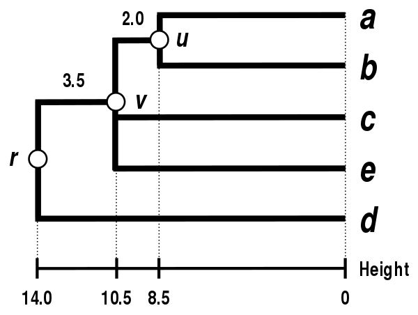

# slc-path

`slc-path` crate is based on the [`single-linkage_clustering`](https://en.wikipedia.org/wiki/Single-linkage_clustering)
method. In statistics, single-linkage clustering is one of several methods of hierarchical clustering.

This method tends to produce long thin clusters in which nearby elements of the same cluster have small distances, but
elements at opposite ends of a cluster may be much farther from each other than two elements of other clusters. For some
classes of data, this may lead to difficulties in defining classes that could usefully subdivide the data. However,
it is popular in astronomy for analyzing galaxy clusters, which may often involve long strings of matter; in this
application, it is also known as the friends-of-friends algorithm.

It is based on grouping clusters in bottom-up fashion (agglomerate clustering), at each step
combining two clusters that contain the closest pair of elements not yet belonging to the same
cluster as each other.

This module principally use the [`kodama`](https://docs.rs/kodama/latest/kodama/) crate. With a
[forked](https://github.com/SubconsciousCompute/kodama) version.

Clustering allows to trace the extent of the impact of a program on the file tree.

# Working Example

## First step

### First clustering

Let us assume that we have five elements `(a,b,c,d,e)` and the following matrix `D1` of pairwise
distances between them:

|          | a    | b    | c   | d   | e   |
|----------|------|------|-----|-----|-----|
| <b>a</b> | 0    | `17` | 21  | 31  | 23  |
| <b>b</b> | `17` | 0    | 30  | 34  | 21  |
| <b>c</b> | 21   | 30   | 0   | 28  | 39  |
| <b>d</b> | 31   | 34   | 28  | 0   | 43  |
| <b>e</b> | 23   | 21   | 39  | 43  | 0   |

In this example, `D1(a,b)=17` is the lowest value of `D1`, so we cluster elements `a` and `b`.

### First distance matrix update

We then proceed to update the initial proximity matrix `D1` into a new proximity matrix `D2`
(see below), reduced in size by one row and one column because of the clustering of `a` with `b`.
Bold values in `D2` correspond to the new distances, calculated by retaining the minimum distance
between each element of the first cluster `(a,b)` and each of the remaining elements:

```
D2((a,b),c)=min(D1(a,c),D1(b,c))=min(21,30)=21
D2((a,b),d)=min(D1(a,d),D1(b,d))=min(31,34)=31
D2((a,b),e)=min(D1(a,e),D1(b,e))=min(23,21)=21
```

Italicized values in `D2` are not affected by the matrix update as they correspond to distances
between elements not involved in the first cluster.

## Second step

### Second clustering

We now reiterate the three previous actions, starting from the new distance matrix `D2`:

|              | (a,b)       | c           | d         | e           |
|--------------|-------------|-------------|-----------|-------------|
| <b>(a,b)</b> | 0           | <b>`21`</b> | <b>31</b> | <b>`21`</b> |
| <b>c</b>     | <b>`21`</b> | 0           | 28        | 39          |
| <b>d</b>     | <b>31</b>   | 28          | 0         | 43          |
| <b>e</b>     | <b>`21`</b> | 39          | 43        | 0           |

Here, `D2((a,b),c)=21` and `D2((a,b),e)=21` are the lowest values of `D2`, so we join cluster `(a,b)`
with element `c` and with element `e`.

### Second distance matrix update

We then proceed to update the `D2` matrix into a new distance matrix `D3` (see below), reduced in
size by two rows and two columns because of the clustering of `(a,b)` with `c` and with `e`:

`D3(((a,b),c,e),d)=min(D2((a,b),d),D2(c,d),D2(e,d))=min(31,28,43)=28`

## Final step

The final `D3` matrix is:

|                    | ((a,b),c,e) | d           |
|--------------------|-------------|-------------|
| <b>((a,b),c,e)</b> | 0           | <b>`28`</b> |
| <b>d</b>           | <b>`28`</b> | 0           |

So we join clusters `((a,b),c,e)` and `d`.
Let `r` denote the `(root)` node to which `((a,b),c,e)` and `d` are now connected.

## The single-linkage dendrogram



The dendrogram is now complete. It is ultrametric because all tips `(a,b,c,e, and d)` are equidistant from `r`:

`δ(a,r) = δ(b,r) = δ(c,r) = δ(e,r) = δ(d,r) = 14`

The dendrogram is therefore rooted by `r`, its deepest node. 